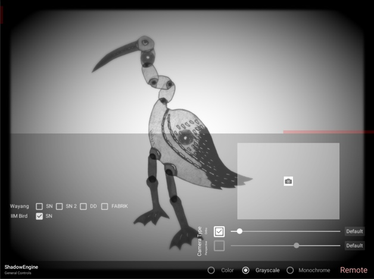

# Chapter 1

This is Chapter 1.
Here is one of my marvellous pictures.

Where is the freaking caption?

# Chapter 2 {#sec:ch2}

This is Chapter 2.

# Chapter 3

This is Chapter 3.

| Type     | Count |  ø Time | Median Time | ø Commits |
| -------- | ----: | ------: | ----------: | --------: |
| Atom     |     9 | 1:30:23 |     0:48:00 |      13,2 |
| Molecule |    10 | 1:20:12 |     1:12:45 |       8,9 |
| Layout   |     5 | 1:21:48 |     0:57:00 |       3,0 |
| Template |     5 | 2:30:30 |     2:27:00 |       4,0 |

: Average Times for Components {#tbl:table1}

# Chapter 4

This is Chapter 4.

[@kozelCloserPerformanceTechnologies2007]